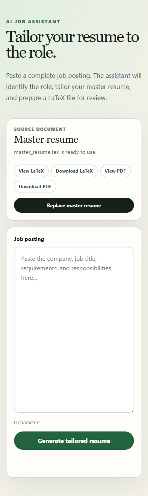

# AI Job Assistant

AI Job Assistant turns a private LaTeX master resume and a raw job posting into
a tailored, reviewable resume. It addresses a familiar job-search problem:
adapting a resume to each role is valuable, but repetitive, slow, and easy to do
inconsistently.

The master resume remains the source of truth. An OpenAI model prioritizes and
rewrites supported material, and the application renders the structured result
into LaTeX. It is explicitly instructed not to invent employers, dates, skills,
or experience.


## Features

- Upload or replace a compatible LaTeX master resume
- Preserve a local backup when the master resume is replaced
- Extract the company, title, and description from a pasted job posting
- Tailor summaries, experience bullets, projects, and technical skills
- Show real generation stages with an elapsed-time indicator
- View or download master and generated resumes as LaTeX
- Compile, view, and download PDFs with Tectonic or another LaTeX engine
- Validate uploads, job postings, generated filenames, and API failures
- Keep private and generated resume files outside Git

<details>
<summary>Mobile interface</summary>



</details>

## Architecture

```text
Browser UI
   |
   | HTTP + status polling
   v
FastAPI application
   |-- Job manager -------- elapsed time and real stage updates
   |-- Job parser --------- structured company/title/description
   |-- Resume tailor ------ content grounded in the master resume
   |-- LaTeX renderer ----- escaped, template-based output
   `-- PDF compiler ------- Tectonic / pdfLaTeX / XeLaTeX / LuaLaTeX
             |
             v
        OpenAI Responses API
```

The browser never receives the OpenAI API key. The Python backend reads it from
the environment and makes model requests server-side.

## Fresh-clone setup

### 1. Requirements

- Python 3.11 or newer
- An OpenAI API key
- Optional: Tectonic, `pdflatex`, `xelatex`, or `lualatex` for PDF export

### 2. Clone and create an environment

```powershell
git clone https://github.com/datal99/ai-job-assistant.git
cd ai-job-assistant
python -m venv .venv
.venv\Scripts\Activate.ps1
python -m pip install --upgrade pip
pip install -r requirements.txt
```

macOS and Linux users can activate with `source .venv/bin/activate`.

### 3. Configure the API key

Copy `.env.example` to `.env`, then replace the placeholder locally:

```powershell
Copy-Item .env.example .env
```

```dotenv
OPENAI_API_KEY=your-key-here
```

Never commit `.env` or paste a real key into browser code. Local environment
files are excluded by `.gitignore`.

### 4. Start the application

```powershell
uvicorn app.main:app --reload
```

Open <http://127.0.0.1:8000>. Upload
[`examples/resumes/master_resume.example.tex`](examples/resumes/master_resume.example.tex),
paste [`examples/job_descriptions/software_engineer.txt`](examples/job_descriptions/software_engineer.txt),
and select **Generate tailored resume**.

The first upload creates the private `resumes/master/` and
`resumes/templates/` files needed by the generation workflow.

## PDF setup

LaTeX viewing and downloading work without additional software. PDF export
requires a supported engine:

- [Tectonic](https://tectonic-typesetting.github.io/book/latest/getting-started/install.html)
  (recommended for a lightweight local setup)
- `pdflatex`
- `xelatex`
- `lualatex`

Put `tectonic.exe` in `tools/tectonic/` for automatic project-local detection,
place an engine on `PATH`, or set `LATEX_ENGINE` to its executable path. The
local tools directory is ignored by Git.

## Tests

The suite does not make live OpenAI requests or modify a real master resume.

```powershell
python -m unittest discover -s tests -v
```

## API overview

| Method | Route | Purpose |
| --- | --- | --- |
| `GET` | `/health` | Service health check |
| `GET` | `/resumes/master` | Master-resume and PDF capability status |
| `POST` | `/resumes/master` | Validate and replace the master resume |
| `POST` | `/resumes/tailor/jobs` | Start background resume generation |
| `GET` | `/resumes/tailor/jobs/{job_id}` | Poll generation status |
| `GET` | `/resumes/master/{format}` | View or download master LaTeX/PDF |
| `GET` | `/resumes/generated/{filename}/{format}` | View/download generated output |

Interactive documentation is available at <http://127.0.0.1:8000/docs> while
the application is running.

## Limitations

- The current build is intended for local, single-user use. It has no
  authentication, per-user file isolation, persistent job queue, or rate limit.
- Generation jobs are stored in memory and disappear when the process restarts.
- Resume files use the local filesystem rather than object storage.
- Model output can omit relevant material or phrase it poorly. Always review the
  generated LaTeX or PDF before submitting it.
- The grounding prompt reduces fabrication risk but cannot guarantee factual
  accuracy. The user remains responsible for every claim in the final resume.
- LaTeX templates requiring unavailable packages may fail PDF compilation.

## Responsible use and privacy

- Use only resume and job-posting data that you are authorized to process.
- Do not treat generated content as verified career history.
- Review for truthfulness, bias, formatting problems, and accidental omissions.
- Job descriptions and the master resume are sent to the configured OpenAI API
  during generation. Do not process information you are not permitted to send.
- Do not expose this version as an unrestricted hosted service. Add
  authentication, quotas, rate limiting, file ownership, and spend controls.

## Repository privacy

The following remain local and are excluded from version control:

- `.env` and other environment files
- `resumes/master/`
- `resumes/templates/`
- generated `.tex` and `.pdf` resumes
- `tools/tectonic/`

The files under `examples/` are synthetic and safe to publish.
